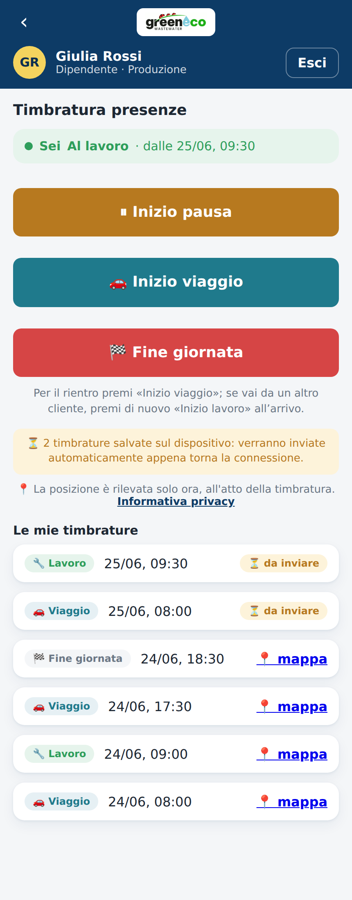
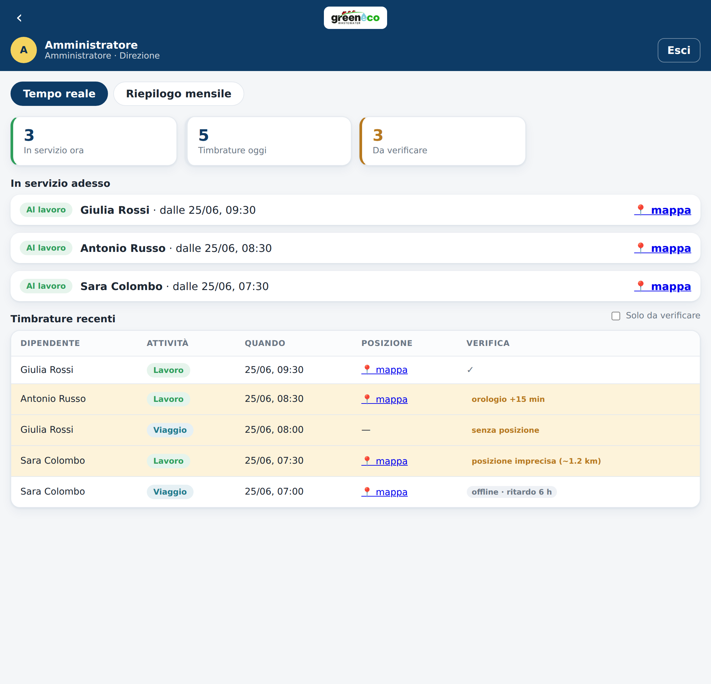

# Manuale preliminare — Modulo "Timbrature Presenze"

**GreenEco — Sistema di rilevazione presenze del personale**

Documento tecnico-funzionale per la valutazione preliminare del Consulente del Lavoro,
in vista di un accordo sindacale e dell'eventuale adozione dello strumento.

| | |
|---|---|
| **Versione documento** | 0.5 — bozza preliminare (modello viaggio/lavoro/pausa, schermate, funzionamento offline, verifiche di attendibilità) |
| **Data** | 25 giugno 2026 |
| **Ambito** | Esclusivamente il modulo "Timbrature Presenze" |
| **Stato dello strumento** | Prototipo dimostrativo (non ancora in esercizio con dati reali) |
| **Destinatario** | Consulente del Lavoro di GreenEco |

> **Avvertenza.** Il presente documento ha natura **tecnico-descrittiva**: illustra come funziona
> lo strumento e quali dati tratta, allo scopo di fornire al Consulente del Lavoro gli elementi
> necessari alla valutazione. **Non costituisce parere legale** né una valutazione di conformità:
> le determinazioni giuridiche (base giuridica del trattamento, applicabilità e modalità dell'art. 4
> dello Statuto dei Lavoratori, contenuto dell'informativa, necessità ed esito di una DPIA, periodo
> di conservazione, utilizzabilità a fini disciplinari) competono al Consulente del Lavoro e, ove
> previsto, al Responsabile della Protezione dei Dati, di concerto con le rappresentanze sindacali.

---

## 1. Scopo dello strumento

Il modulo "Timbrature Presenze" consente al personale di GreenEco di registrare **entrate e uscite**
dal servizio tramite un'applicazione web utilizzabile da smartphone (o computer), e all'azienda di
disporre di un **riepilogo mensile** delle ore lavorate, con distinzione tra **ore ordinarie** e
**ore straordinarie**.

Le finalità perseguite (da confermare e circoscrivere con il Consulente del Lavoro) sono:

1. **Rilevazione della presenza** e dell'orario di lavoro effettivo del personale;
2. **Gestione amministrativa** delle ore ai fini di paga, con evidenza separata dello straordinario;
3. **Verifica della presenza presso il luogo di lavoro/cantiere** al momento della timbratura
   (funzione di geolocalizzazione, opzionale e attivabile — v. § 5).

> **Nota metodologica.** La definizione puntuale delle finalità è il presupposto di tutto l'impianto
> giuridico (base giuridica, proporzionalità, informativa). Si richiede al Consulente di validare o
> ridefinire le finalità sopra elencate, in particolare in merito alla geolocalizzazione.

---

## 2. Soggetti coinvolti

| Ruolo nello strumento | Chi è | Cosa può fare |
|---|---|---|
| **Dipendente** | Lavoratore | Timbra la propria entrata/uscita; vede **solo** le proprie timbrature. |
| **Manager / Preposto** | Responsabile di squadra | Vede lo stato "in servizio" e le timbrature **del proprio team**; consulta e scarica il cartellino mensile dei propri collaboratori. |
| **Amministratore** | Ufficio del personale / titolare delegato | Vede e scarica le timbrature e i cartellini di **tutto il personale**; gestisce gli utenti; esporta i dati. |

**Ruoli ai fini privacy (da formalizzare):**

- **Titolare del trattamento:** GreenEco (società datrice di lavoro).
- **Responsabili del trattamento (esterni):** i fornitori dell'infrastruttura tecnica che ospitano i
  dati e l'applicazione (servizio di database/hosting e piattaforma di pubblicazione). Andranno
  individuati e nominati ex art. 28 GDPR, con verifica del luogo di conservazione dei dati (UE/extra-UE).
- **Soggetti autorizzati:** amministratore e manager, da istruire e autorizzare al trattamento.

---

## 3. Come funziona la timbratura (lato dipendente)

La giornata tipo del personale è articolata in **viaggio di andata → lavoro presso il cliente →
viaggio di ritorno**, con eventuali **pause** ed eventualmente **più clienti** in giornata. Per
distinguere correttamente queste fasi, la timbratura adotta un modello **"dichiara attività"**: ad
ogni passaggio il lavoratore indica l'attività che **inizia** in quel momento; questa timbratura
**chiude automaticamente** l'attività precedente.

Le attività previste sono:

- **Viaggio** — tempo di trasferimento (pagato, ma **mai** conteggiato come straordinario);
- **Lavoro** — attività presso il cliente (ordinaria fino alla soglia, poi straordinaria);
- **Pausa** — pausa pranzo o altra sospensione **non retribuita** (con timbratura di inizio e di
  ripresa);
- **Fine giornata** — chiude l'ultima attività.

**Flusso operativo:**

1. Il dipendente accede e apre la sezione **"Timbrature Presenze"**.
2. **Alla prima timbratura** viene mostrata un'**informativa** da leggere prima di procedere
   (v. Allegato A: la versione attuale è un **segnaposto** da sostituire con il testo validato).
3. La schermata mostra lo **stato corrente** ("Fuori servizio" / "In viaggio" / "Al lavoro" / "In
   pausa") e i soli pulsanti pertinenti, ad esempio: da *Al lavoro* sono disponibili `Inizio pausa`,
   `Inizio viaggio`, `Fine giornata`.
4. Premendo un pulsante, **solo in quel momento** l'applicazione rileva la posizione (v. § 5) e
   registra la timbratura con data, ora e attività.
5. Lo storico mostra le proprie timbrature, ciascuna con attività, orario e — se disponibile — un
   collegamento alla posizione su mappa.

**Esempio di giornata:** *Inizio viaggio* 08:00 → *Inizio lavoro* 09:30 → *Inizio pausa* 13:00 →
*Riprendi lavoro* 14:00 → *Inizio viaggio* 17:30 → *Fine giornata* 19:00. Risultato: **lavoro 6:30,
viaggio 3:00, pausa 1:00 (non pagata)**.

**Schermate del dipendente** *(immagini con dati dimostrativi):*


*Accesso: il dipendente entra con il proprio ID e password.*


*Alla prima timbratura compare l'informativa (testo segnaposto, da validare).*


*Fuori servizio: si avvia il viaggio verso il cliente oppure, se già sul posto, il lavoro.*


*In viaggio: all'arrivo dal cliente si preme «Inizio lavoro»; al rientro «Fine giornata» chiude anche il viaggio.*


*Al lavoro: si può avviare la pausa, il viaggio di ritorno o chiudere la giornata. In basso lo storico con l'attività di ogni timbratura.*


*In pausa: delimitata da inizio e ripresa, non viene conteggiata.*

**Caratteristiche rilevanti ai fini della valutazione:**

- Le **ore di viaggio sono separate** da quelle di lavoro e **non concorrono mai allo straordinario**.
- La **pausa** è delimitata da una timbratura di **inizio** e una di **ripresa** e **non è
  conteggiata** (né lavoro né viaggio).
- La rilevazione della posizione avviene **esclusivamente all'atto della singola timbratura**: **non**
  esiste alcun tracciamento continuo o in background.
- Se il dipendente **nega** il permesso di posizione, o il dato non è disponibile, **la timbratura
  viene comunque registrata "senza posizione"**: la timbratura non è impedita.

---

## 4. Dati trattati

Per ciascuna timbratura il sistema registra i seguenti dati (tabella `time_clockings`):

| Dato | Descrizione | Note |
|---|---|---|
| Identificativo timbratura | Codice univoco interno | — |
| Identificativo lavoratore | Riferimento all'anagrafica dipendente | Pseudonimo/ID, collegato all'anagrafica |
| Attività | "Viaggio", "Lavoro", "Pausa" o "Fine giornata" | Attività che inizia con la timbratura |
| Data e ora | Istante della timbratura | Con fuso orario |
| Latitudine / Longitudine | Posizione al momento della timbratura | **Solo se** consentita/disponibile; può essere assente |
| Accuratezza | Margine di errore stimato della posizione (metri) | Indicativo |

**Dati NON trattati da questo modulo:** non vengono raccolti dati biometrici, non vengono registrati
spostamenti tra una timbratura e l'altra, non viene effettuato alcun monitoraggio dell'attività del
dispositivo o della navigazione.

> **Da definire con il Consulente:** il **periodo di conservazione** dei dati di timbratura e di
> posizione (proposta tecnica di default da concordare, es. distinzione tra dato presenza ai fini paga
> e dato di posizione, con conservazione di quest'ultimo ridotta al minimo necessario).

---

## 5. Geolocalizzazione — principi adottati

La geolocalizzazione è il punto di maggiore attenzione giuridica e merita una trattazione specifica.
Lo strumento è stato progettato secondo il principio di **minimizzazione** (privacy by design):

- **Rilevazione puntuale, non continuativa:** la posizione è acquisita **solo nell'istante della
  timbratura**, non prima e non dopo. Non c'è tracciamento del percorso né localizzazione periodica.
- **Finalità circoscritta:** verificare che la timbratura avvenga presso il luogo di lavoro/cantiere.
- **Non bloccante e degradabile:** la mancata concessione del permesso non impedisce la timbratura
  (che resta valida "senza posizione"), evitando di costringere il lavoratore a cedere il dato.
- **Trasparenza:** all'utente è mostrato un avviso esplicito ("la posizione è rilevata solo ora,
  all'atto della timbratura") e l'accesso all'informativa.
- **Dato grezzo minimo:** vengono salvate coordinate e accuratezza puntuali, senza arricchimenti.

**Opzioni configurabili da concordare** (attualmente non implementate, ma previste come evoluzione):

- **Geolocalizzazione disattivabile** del tutto, qualora non ritenuta necessaria/proporzionata;
- **Verifica per area** (geofencing): registrare solo se la timbratura è dentro un raggio definito
  attorno a una sede/cantiere, eventualmente memorizzando **solo l'esito** ("dentro/fuori area") e non
  le coordinate puntuali — soluzione più rispettosa della minimizzazione;
- **Tolleranza/arrotondamento** della posizione.

> **Punto centrale per l'accordo sindacale.** La presenza di una funzione di geolocalizzazione, anche
> se puntuale e non continuativa, può configurare lo strumento come potenzialmente idoneo al
> **controllo a distanza dell'attività dei lavoratori** ai sensi dell'**art. 4 della Legge 300/1970
> (Statuto dei Lavoratori)**. Si richiede al Consulente la valutazione circa (a) la riconducibilità
> dello strumento al comma 1 (impianti dai quali derivi anche la possibilità di controllo a distanza,
> che richiedono **accordo con la RSU/RSA o autorizzazione dell'Ispettorato Territoriale del Lavoro**)
> oppure al comma 2 (strumenti utilizzati per rendere la prestazione e di registrazione degli accessi
> e presenze, esenti da accordo), e (b) l'incidenza della componente di geolocalizzazione su tale
> qualificazione.

---

## 6. Riepilogo mensile e calcolo delle ore (lato manager/amministratore)

Oltre alla vista in tempo reale ("in servizio ora", timbrature recenti), il sistema produce un
**cartellino mensile** per ciascun dipendente.

- **Selezione** del mese (corrente o precedenti) e del dipendente.
- **Una riga per ogni giorno** del mese, con, in colonne separate: **ore lavorate**, **di cui
  straordinarie**, **ore viaggio**, **ore pausa** e **totale retribuito** (lavoro + viaggio), oltre a
  inizio/fine giornata.
- **Soglia giornaliera** delle ore ordinarie **impostabile** (valore predefinito 8 ore): oltre la
  soglia, le ore **di solo lavoro** sono conteggiate come straordinario.
- **Le ore NON sono arrotondate:** è riportato il **tempo effettivo** (precisione al minuto a video,
  valore esatto nei file esportati). Esempio: 1 ora e 30 minuti resta 1:30.
- **Esportazione** del cartellino in formato CSV (compatibile con Excel), per singolo dipendente o in
  un unico file per tutto il personale.

**Criterio di calcolo (trasparente e verificabile):** le timbrature sono ordinate cronologicamente;
ogni intervallo tra due timbrature è un **segmento** dell'attività dichiarata dalla prima (viaggio,
lavoro o pausa), la cui durata è sommata nel giorno in cui è svolta (un segmento a cavallo della
mezzanotte è ripartito tra i due giorni). Per ciascun giorno:

- **ore di lavoro** = somma dei segmenti di lavoro; **ore di viaggio** = somma dei segmenti di viaggio;
  **pausa** = somma dei segmenti di pausa (non pagata);
- **ore ordinarie** = minimo tra ore di lavoro e soglia; **straordinarie** = eccedenza **delle sole
  ore di lavoro**;
- il **viaggio è pagato ma non concorre mai allo straordinario**; la **pausa non è retribuita**.

**Schermate per manager/amministratore** *(immagini con dati dimostrativi):*


*Tempo reale: chi è in viaggio / al lavoro / in pausa in questo momento e l'elenco delle timbrature recenti.*


*Riepilogo mensile: per ogni giorno ore di lavoro, di cui straordinarie, viaggio, pausa e totale retribuito, con totali di fine mese e download in CSV.*

> **Da definire con il Consulente:** se il calcolo dello straordinario debba avvenire su base
> **giornaliera** (come oggi) o **settimanale/contrattuale**; il trattamento di festivi, notturni,
> permessi e assenze; la **qualificazione e remunerazione delle ore di viaggio** secondo il CCNL
> applicato. Lo strumento espone un dato **di supporto**, non un cartellino con valore legale (v. § 10).

---

## 7. Gestione delle anomalie

Il sistema **segnala** ma non "indovina" le situazioni irregolari, per non alterare i dati.
Nel cartellino possono comparire note come:

- **"in servizio"** — l'ultima attività non è ancora stata chiusa (giornata in corso,
  oppure non chiusa con "Fine giornata");
- **"manca Fine giornata"** — un segmento che attraversa la mezzanotte senza una
  timbratura di chiusura.

A queste si aggiungono le **segnalazioni di verifica** (posizione, orario,
sincronizzazione) descritte al § 9.

> **Da definire:** la procedura di **rettifica/giustificazione** delle anomalie (chi può correggere,
> con quale tracciabilità delle modifiche), aspetto rilevante sia ai fini gestionali sia di garanzia
> per il lavoratore.

---

## 8. Continuità senza connessione (buffer di sicurezza)

Lo strumento è pensato per essere usato anche dove la rete è debole o assente
(seminterrati, impianti, zone senza copertura). Per questo adotta più livelli di
sicurezza contro la perdita di dati:

- **Apertura offline.** L'app è una *web-app installabile*: il suo "guscio" resta
  in memoria sul dispositivo, quindi **si apre anche senza connessione**.
- **Memoria locale degli ultimi 7 giorni (lettura).** Le timbrature recenti
  restano salvate sul dispositivo: se il database non è raggiungibile, il
  dipendente vede comunque lo storico recente e l'app conosce lo **stato
  corrente** (quindi propone i pulsanti giusti).
- **Coda di invio (scrittura).** Una timbratura che non raggiunge il database
  viene **salvata sul dispositivo e confermata subito** al dipendente, poi
  **reinviata automaticamente** appena torna la connessione (o alla riapertura
  dell'app). **Nessuna timbratura viene persa.**

Garanzie tecniche rilevanti ai fini della valutazione:

- l'orario registrato è quello **del momento della timbratura** (il tocco), non
  quello del successivo invio al database;
- l'invio è **idempotente**: un reinvio non crea timbrature duplicate;
- il dispositivo mostra in modo evidente quante timbrature sono **in attesa di
  invio** (avviso nell'intestazione, sempre visibile, e indicazione "da inviare"
  accanto alle singole righe).


*Esempio: due timbrature effettuate senza rete sono salvate sul dispositivo e
contrassegnate "da inviare"; partiranno da sole al ritorno della connessione.*

> **Nota per il manager.** Le timbrature non ancora sincronizzate, per loro
> natura, non sono ancora sul server: compaiono nel riepilogo centrale (e quindi
> al manager) **non appena il dispositivo torna online**, già con l'orario reale
> della timbratura. Eventuali limiti: i dati del buffer restano sul dispositivo
> (in chiaro) e riguardano solo gli ultimi 7 giorni; il rilevamento automatico
> dell'assenza di rete può non riconoscere alcune reti "captive" (Wi-Fi che
> sembra attivo ma non naviga), nel qual caso la timbratura viene comunque
> messa in coda dopo il tentativo fallito.

---

## 9. Attendibilità delle timbrature e segnalazioni di verifica

Lo strumento adotta alcune misure per garantire l'**attendibilità del dato** e per
rendere **evidenti e verificabili** le situazioni dubbie. Le misure **non bloccano**
il lavoratore: producono **segnalazioni** che il manager/amministratore può
controllare.

**Integrità dell'orario.**

- Con connessione attiva, l'orario ufficiale della timbratura è quello del
  **server**, non quello del telefono: regolare diversamente l'orologio del
  dispositivo **non incide** sull'orario registrato.
- Senza connessione, si conserva l'orario indicato dal telefono (unico
  disponibile), ma la timbratura resta **marcata** e si registra lo **scarto**
  rispetto all'orario di arrivo al server.

**Posizione.** Rilevata solo al momento del tocco (v. § 5), in due passaggi:
prima la posizione **precisa** (GPS); se non disponibile, una posizione
**approssimata** (rete cellulare / Wi-Fi) anziché nessuna posizione. Viene sempre
registrato il **raggio di precisione**.

**Tracce raccolte per ogni timbratura** (a supporto delle verifiche): orario del
dispositivo, orario di arrivo al server, presenza/assenza di connessione al
momento, scarto d'orario, posizione e relativa precisione.

**Segnalazioni "da verificare"** mostrate al manager nella vista in tempo reale
(colonna *Verifica*, con filtro "solo da verificare" e conteggio):

- *senza posizione* — timbratura registrata senza coordinate;
- *posizione imprecisa* — raggio molto ampio (tipico con GPS disattivato);
- *orologio sfasato* — orario del dispositivo distante da quello del server;
- *offline · ritardo* — timbratura salvata sul dispositivo e sincronizzata molto
  dopo (indicazione informativa, non necessariamente critica).

Le stesse segnalazioni confluiscono nelle **Note del cartellino** e nel **CSV**.


*Le segnalazioni sono evidenziate nella colonna "Verifica"; le righe da
controllare sono messe in risalto e contate nella scheda "Da verificare".*

> **Verifica posizione ↔ rete (opzionale).** È predisposto, ma **disattivato**, un
> confronto tra la posizione e la collocazione approssimata dell'indirizzo di
> rete (IP). Va valutato col Consulente prima di un'eventuale attivazione, perché
> più incisivo sul piano del controllo.

**Limiti dichiarati con trasparenza.** L'applicazione gira nel browser del
telefono del dipendente e **non può controllarne il dispositivo in modo
assoluto**: in particolare, da web non è possibile riconoscere una posizione GPS
**simulata**. Se il lavoratore **non concede il permesso di localizzazione**, la
posizione non è disponibile e la timbratura resta segnalata "senza posizione".
Per garanzie più solide sul dispositivo servirebbe un'app **dedicata (nativa)** o
un **terminale di timbratura in sede**. Le misure descritte mirano quindi a
rendere le situazioni dubbie **difficili da nascondere e tracciabili**, più che a
impedirle in assoluto.

> **Profilo normativo.** Questi trattamenti possono configurare controlli a
> distanza: vanno improntati a **proporzionalità**, preceduti da **informativa**
> e, ove ricorra, da **accordo sindacale o autorizzazione dell'ITL** (art. 4
> L. 300/1970), oltre alle basi del GDPR. Le misure più incisive (es. confronto
> con l'indirizzo di rete) vanno attivate solo previa valutazione.

---

## 10. Stato attuale dello strumento e percorso verso la produzione

Per correttezza verso il Consulente si dichiara con trasparenza lo **stato di avanzamento**.

**Stato attuale: prototipo dimostrativo.** Lo strumento è funzionante e pubblicato, ma è da intendersi
ad oggi come **dimostratore**: utilizzato con **dati di prova**, **non ancora idoneo a trattare dati
reali del personale** in produzione. In particolare:

- l'accesso è gestito con un meccanismo provvisorio, **non ancora basato su autenticazione robusta**;
- le regole di **isolamento dei dati a livello di database** (per cui ciascuno acceda solo ai dati di
  propria competenza) **non sono ancora applicate in modo forte**;
- l'**informativa** mostrata è un **segnaposto** (Allegato A) da sostituire con il testo validato;
- il meccanismo attuale di "consenso" all'avvio **è da rivedere** (v. § 11 sulla base giuridica).

**Requisiti tecnici per l'esercizio (roadmap):**

1. Autenticazione reale degli utenti e isolamento forte dei dati (controlli a livello di database);
2. Backup automatici e procedura di ripristino documentata;
3. Definizione e applicazione del periodo di conservazione;
4. Registro dei trattamenti, nomine dei responsabili esterni, verifica ubicazione dei dati;
5. Eventuale DPIA (valutazione d'impatto) se ritenuta necessaria per la geolocalizzazione.

**Requisiti giuridico-organizzativi (di competenza del Consulente / azienda / sindacato):**

1. **Procedura ex art. 4 L. 300/1970**: accordo con la RSU/RSA oppure autorizzazione dell'ITL, ove
   applicabile;
2. **Base giuridica** del trattamento ai sensi dell'art. 6 GDPR (di norma per il rapporto di lavoro
   **non** il consenso, ma l'esecuzione del contratto / obbligo legale / legittimo interesse —
   valutazione del Consulente/DPO);
3. **Informativa ex art. 13 GDPR** e **informativa sulle modalità d'uso e sui controlli** ex art. 4,
   co. 3, Statuto dei Lavoratori, quale condizione per l'utilizzabilità dei dati anche a fini
   disciplinari;
4. Valutazione di **proporzionalità e necessità** della geolocalizzazione rispetto alle finalità.

---

## 11. Quadro normativo di riferimento (per la valutazione)

Si elencano, a titolo ricognitivo e non esaustivo, le fonti rilevanti che il Consulente vorrà
considerare:

- **Art. 4, Legge 20 maggio 1970, n. 300 (Statuto dei Lavoratori)** — impianti e strumenti dai quali
  derivi la possibilità di controllo a distanza; necessità di accordo sindacale o autorizzazione ITL;
  obbligo di informativa sulle modalità d'uso e sui controlli (co. 3).
- **Regolamento (UE) 2016/679 (GDPR)** e **D.lgs. 196/2003** come adeguato — principi di liceità,
  minimizzazione, limitazione della conservazione (art. 5); base giuridica (art. 6); informativa
  (art. 13); valutazione d'impatto (art. 35) ove il trattamento presenti rischi elevati, ipotesi
  frequentemente associata alla **geolocalizzazione sistematica dei lavoratori**.
- **Provvedimenti e linee guida del Garante per la protezione dei dati personali** in materia di
  geolocalizzazione e controllo dei lavoratori.
- **CCNL applicato** e disciplina contrattuale dell'orario di lavoro e dello straordinario.

> **Sintesi dei punti che richiedono una decisione esterna allo strumento:**
> 1. Qualificazione ex art. 4 e relativa procedura (accordo sindacale / autorizzazione ITL);
> 2. Base giuridica del trattamento e revisione dell'attuale meccanismo di "consenso";
> 3. Necessità/proporzionalità ed eventuale riconfigurazione della geolocalizzazione (es. solo
>    esito "dentro/fuori area");
> 4. Periodo di conservazione dei dati;
> 5. Necessità di una DPIA;
> 6. Procedura di rettifica delle timbrature e regole d'uso;
> 7. Valore (di supporto o legale) attribuito al cartellino e criterio di calcolo dello straordinario.

---

## Allegato A — Bozza/segnaposto di informativa al lavoratore

> **Testo attualmente mostrato nell'app — DA SOSTITUIRE.** È un segnaposto privo di valore: il testo
> definitivo dovrà essere redatto/validato dal Consulente del Lavoro e dal DPO e includere almeno:
> titolare e contatti, finalità, base giuridica, categorie di dati (incl. posizione), modalità di
> raccolta (puntuale all'atto della timbratura), destinatari/responsabili e ubicazione dei dati,
> periodo di conservazione, diritti dell'interessato e modalità di esercizio, riferimento all'accordo
> ex art. 4 e alle regole d'uso.

## Allegato B — Schema dei dati di una timbratura

```
timbratura {
  id                  identificativo univoco
  dipendente          riferimento all'anagrafica (ID)
  attivita            "viaggio" | "lavoro" | "pausa" | "fine"
  data_ora            istante della timbratura (con fuso orario)
  latitudine          opzionale (solo se consentita/disponibile)
  longitudine         opzionale (solo se consentita/disponibile)
  accuratezza_m       opzionale (margine di errore in metri)
}
```

## Allegato C — Esempio illustrativo di cartellino mensile (dati fittizi)

| Giorno | Inizio | Fine | Lavorate | di cui Straord. | Viaggio | Pausa | Retribuito | Note |
|---|---|---|---|---|---|---|---|---|
| Lun 01 | 08:00 | 18:30 | 8:00 | 0:00 | 2:00 | 0:30 | 10:00 | |
| Mar 02 | 07:30 | 19:00 | 9:30 | 1:30 | 1:30 | 0:30 | 11:00 | |
| Mer 03 | 08:05 | — | 0:00 | 0:00 | 0:00 | 0:00 | 0:00 | in servizio |
| … | | | | | | | | |
| **Totali** | | | **17:30** | **1:30** | **3:30** | **1:00** | **21:00** | |

*(Soglia ore ordinarie/giorno: 8,00, applicata alle sole ore di lavoro. Il viaggio è pagato ma mai
straordinario; la pausa non è retribuita. Valori effettivi, non arrotondati.)*

---

*Documento predisposto a supporto della valutazione preliminare. Le scelte giuridiche e organizzative
indicate come "da definire" sono rimesse al Consulente del Lavoro di GreenEco, di concerto con le
rappresentanze sindacali e, ove nominato, con il Responsabile della Protezione dei Dati.*
